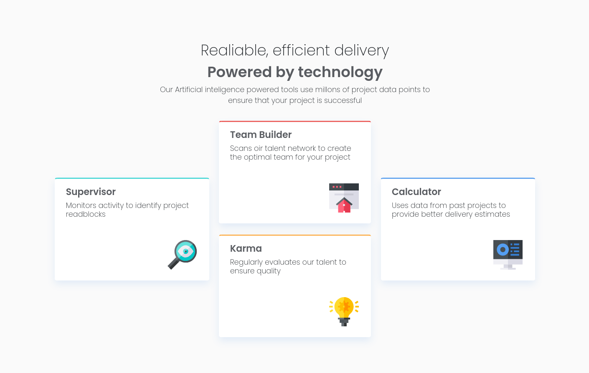

# Frontend Mentor - Four card feature section solution

This is a solution to the [Four card feature section challenge on Frontend Mentor](https://www.frontendmentor.io/challenges/four-card-feature-section-weK1eFYK). Frontend Mentor challenges help you improve your coding skills by building realistic projects. 

## Table of contents

- [Overview](#overview)
  - [The challenge](#the-challenge)
  - [Screenshot](#screenshot)
  - [Links](#links)
- [My process](#my-process)
  - [Built with](#built-with)
  - [Continued development](#continued-development)
  - [Useful resources](#useful-resources)
- [Author](#author)

## Overview

### The challenge

Users should be able to:

- View the optimal layout for the site depending on their device's screen size

### Screenshot

### Links

- Solution URL: [https://github.com/anthoni-gmu/card](https://github.com/anthoni-gmu/card)
- Live Site URL: [https://anthoni-gmu.github.io/card/](https://anthoni-gmu.github.io/card/)

## My process

### Built with

- Semantic HTML5 markup
- CSS custom properties
- flexbox fron bootstrap
- Sass in Bootstrap

### Continued development

I am very excited about what I am achieving, I will continue to bootstrap with sass

### Useful resources

- [w3schols](https://www.w3schools.com/css/default.asp) 
- [bootstrap5](https://getbootstrap.com/docs/5.0/getting-started/introduction/) 

## Author

- Instagram - [tons0ft](https://www.instagram.com/tons0ft/) 
- Frontend Mentor - [anthoni-gmu](https://www.frontendmentor.io/profile/anthoni-gmu)

